% Rapport SAÉ 2.03
% Corentin LORMIER;Kylian ALLARD-GUERENTE;Noah HOYLAERTS
% 23 Mars 2025

---

# **Préparation de la machine virtuelle**

## Étape 1 : Installer Oracle VirtualBox

Si ce n’est pas déjà fait, veuillez **télécharger le logiciel Oracle VirtualBox** [ici](https://www.virtualbox.org/wiki/Downloads). \
Installez-le et lancez le logiciel. Il va vous permettre de **créer des machines virtuelles sur votre machine**. \
Après un instant, vous devriez avoir un menu semblable à celui-ci :  \

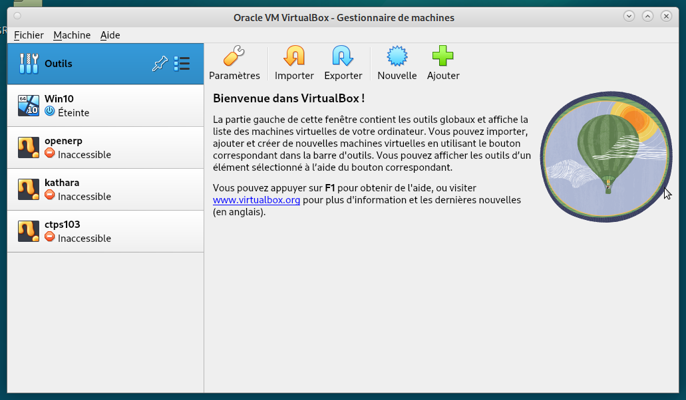

Félicitation ! Vous avez installé Oracle VirtualBox avec succès et pouvez désormais passer à l’étape suivante de ce guide d’installation !  

## Étape 2 : Création une nouvelle machine virtuelle

Dans cette étape, vous allez apprendre à **configurer votre 1ère machine virtuelle.** \
Pour commencer, cliquez sur le bouton « Nouvelle » afin de **commencer la création d'une nouvelle machine virtuelle.** \
Une nouvelle fenêtre s’ouvre à vous et devrait ressembler à ça :  \

 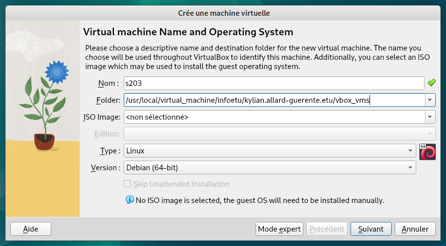

Commencez par **lui donner un nom**, de préférence bien distinctif pour s'y retrouver. Ici on a donc mis « sae203 ». \

Par défaut, le logiciel utilise un chemin prédéfini pour installer la machine virtuelle : 
```bash
C:\Users\*nom_utilisateur*\VirtualBox VMs
```
Il faut **changer le chemin par celui-ci** :
```bash
C:\Users\*nom_utilisateur*\VirtualBox
```
Cela sera utile par la suite pour l'auto-installation. \

Maintenant, passons au type machine virtuelle : \
Dans la rubrique « Type », **sélectionner « linux » → « subtype » → « Debian (64-bit)».** \
Ceci fait, le logiciel sélectionnera une version de base en 64bit. \

**Appuyez sur** « finish » pour finir la création de votre machine virtuelle. 

## Étape 3 : Configuration de la machine virtuelle

Maintenant que la machine virtuelle est créée, passons aux paramètrages. \
Pour ce faire, **cliquez sur votre machine virtuelle** fraichement créée et **sélectionnez « Configuration ».** \
Une nouvelle fenêtre devrait s’ouvrir et ressembler à ça :  

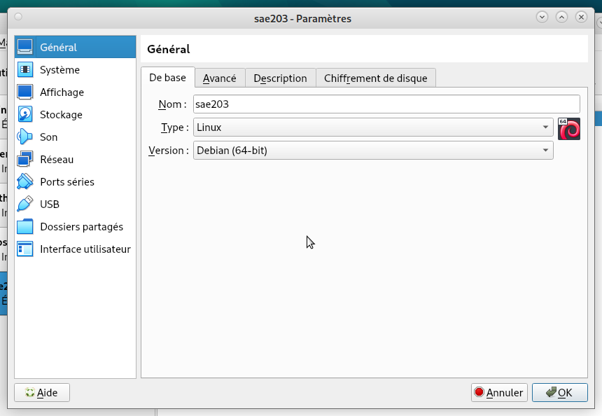

Par défaut, le logiciel utilise des paramètres demandant peu de ressources pour fonctionner. \
Si votre PC est puissant alors je vous conseille de **modifier ces paramètres** : \
**Allez dans la rubrique « system »** et **augmentez la mémoire jusque 2048 Mo et 20 Go de stockage.**

Ensuite, installez le système d’exploitation que vous souhaitez : \
Pour ce faire **cliquez sur l’onglet « Stockage »** et **sélectionnez le petit disque bleu** en dessous de « contrôleur IDE », puis **sélectionnez de nouveau ce disque bleu**, et enfin **appuyez sur l’option « Choose a disk file »** comme dans l’image indiqué ci-contre :  \

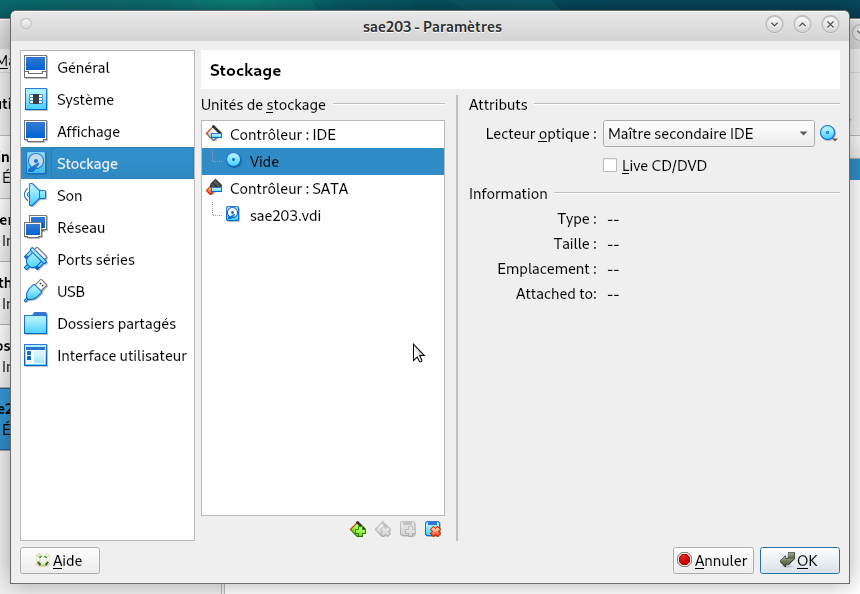

Pour finir, **sélectionnez l’image disque contenant votre système d’exploitation** et **appuyez sur « OK ».** \
Dans notre cas ça sera l'ISO disponible sur le site officiel de Debian (donc Debian 12). \

Maintenant, votre machine est installée et prête à être utilisée.

---

### Questions
* Que signifie “64-bit” dans “Debian 64-bit” ? \

> 64 bits signifie que c’est un logiciel fait pour un [processeur de type *64 bits*](https://fr.wikipedia.org/wiki/Processeur_64_bits), un processeur plus puissant qu’un *32 bits*, fait pour avoir un plus __grand nombre de calculs par seconde__. \ 
Cela peut signifier que la version Debian 32-bit n’est pas exécutable par un ordinateur 64-bit, ils ont donc besoin d’une version spécifique pour le 64-bit.

* Quelle est la configuration réseau utilisée par défaut ? \

> La configuration réseau par défaut est le **NAT**[^NAT], un réseau où la machine virtuelle a accès à Internet et a donc sa propre adresse IP par le DHCP VirtualBox *et non par notre réseau local*, ainsi les machines physiques de notre réseau n’ont pas accès à la machine virtuelle car elle n’a pas **d’IP par le DHCP local**. \

* Quel est le nom du fichier XML contenant la configuration de votre machine ? \

> Il s’appelle tout simplement **sae203.vbox**, à ouvrir avec un éditeur de texte *(l’exécuter lancera la VM)*, on y retrouve tous les paramètres comme : \
> 1. Le nombre de processeurs, \
> 2. La mémoire allouée, \
> 3. L’UUID du hard disk, de l’image \
> 4. Leur emplacement sur la machine locale...\
>
>C’est bien un fichier xml car la 1ere ligne est : **\<?xml version="1.0"?>.** \
L’emplacement du fichier est relatif à chaque machine, dans mon cas : \
*C:\Users\Toyger\VirtualBoxVMs\sae203\.* \

*  Sauriez-vous le modifier directement ce fichier de configuration pour mettre 2 processeurs à votre machine ? \

> Dans le fichier, on le retrouve dans la balise **Hardware** puis la balise **CPU count** = 2, dans notre cas, CPU count = 1, car nous n’avons assigné qu’un **seul processeur à la VM**.

---

# Installation de l'OS

**Lancez votre machine virtuelle,** vous allez pouvoir lancer l'installation de votre système d'exploitation. \
Pour celà, au fur et à mesure vous allez devoir insérer les informations qui suivent :

* Nom de la machine : « serveur »
* Domaine : Aucun
* Pays/Langue : France/Français
* Miroir : Polytech http://debian.polytech-lille.fr, sans proxy
* Créer l'utilisateur User : Login : user ; Mot de passe : user
* Créer l'utilisateur root : Login : root ; Mot de passe : root
* Sélections des logiciels de démarrage :
    - [x] Environnement de bureau Debian
    - [ ] GNOME
    - [ ] Xfce
    - [ ] bureau GNOME Flashback
    - [ ] KDE Plasma
    - [ ] Cinnamon
    - [x] MATE
    - [ ] LXDE
    - [ ] LXQt
    - [x] serveur web
    - [x] serveur SSH
    - [x] utilitaires usuels du système

Maintenant **finissez l'installation du système d'exploitation.**

---

### Questions

*  Qu’est-ce qu’un fichier iso bootable ? \

> Un fichier ISO est un fichier **qui remplace un CD/DVD**. Il permet l’exécution de programme comme un système d’exploitation sur une clé USB ( winzip; pc mag).

*  Qu’est-ce que MATE ? GNOME ? \

> **MATE est un environnement de bureau**. MATE est basé sur GNOME. Il a été créer suite a GNOME 3 jugé insatisfaisant par la communauté. **GNOME est l’environnement de bureau par défaut sur de nombreuse distribution Linux** (Wikipédia, Mate-desktop.org, wiki.debian.org). \

* Qu’est-ce qu’un serveur web ? \

> Un serveur web est un serveur qui **fournit les fichiers nécessaires à l’affichage d’une page web a l’utilisateur**. Il peut aussi stocker des données. (solarwinds, le mag it). \

* Qu’est-ce qu’un serveur ssh ? \

> Un serveur SSH est un serveur utilisant le protocole SSH. **Le protocole SSH permet de donner l’accès à distance à un autre ordinateur**. Toute les commande effectue depuis le terminal hôte seront exécuté sur le terminal cible. (le mag it, zah.uni-heidelbzeg.de). \

* Qu’est-ce qu’un serveur mandataire ? \

> Un serveur mandataire est un serveur entre un serveur et un ordinateur. **Il permet la connexion en y ajoutant une couche de sécurité supplémentaire** (it-connect, support-apple, cyber-management-school.com ). \

---

# Préparation du système

Maintenant que l'installation est finie, nous avons accès au bureau et au terminal Linux et donc Bash. \
Nous pouvons donc **donner les droits Sudo à notre utilisateur.** \ 
Pour cela, **ouvrez un terminal avec le raccourci clavier `ctrl+alt+t` puis entrez cette commande** : \
```bash
sudo usermod -aG sudo <username>
```

---

### Question
* Comment peux-ton savoir à quels groupes appartient l’utilisateur user ? \

> Effectuer la commande suivante dans un terminal Linux : ```groups user```, qui donne tous les groupes auxquels appartient user : \

`user, cdrom, floppy, sudo, audio, dip, video, users, netdev, lpadmin, scanner` \

> On retrouve bien le groupe sudo après y avoir ajouté user. \

---

On va maintenant **installer des suppléments invités.** \
Pour celà nous devons **monter nos disques et installer des suppléments de compilation et fichiers.** \

Nous devons d'abord **insérer le CD possédant les suppléments et sélectionner "Insérer l'image CD des additions invités".** \
Puis **exécuter les commandes suivantes** : \
1. `sudo mount /dev/cdrom /mnt` : Sert à monter le CD. \
2. `sudo /mnt/VBoxLinuxAdditions.run` : Sert à installer nos suppléments. \

Puis nous pouvons **redémarrer notre machine** et voir si les modifications ont bien été prises en compte. \

---

### Questions

* Quel est la version du noyau Linux utilisé par votre VM ? \

> En effectuant la commande : cat /etc/os-release, on obtient : \
\
```
PRETTY NAME= «Debian GNU/Linux 12 (bookworm) »
NAME = « Debian GNU/Linux »
VERSION_ID = « 12 »
...(D’autres informations sont affichées).
```
> On retrouve bien notre distribution (Debian GNU/Linux) qui serait à la version 12 (VERSION_ID).

* À quoi servent les suppléments invités ? \

> Les suppléments invités[^invit] sont des **pilotes adaptés aux systèmes invités** (Windows, GNU/Linux ...) qui servent à **relier facilement une machine hôte et une machine virtuelle (invitée) installée dessus**. Installer ces suppléments permet de **partager entre les deux machines le presse papier ou encore les dossiers**. La gestion de la souris est aussi plus dynamique lorsqu’elle se déplace entre le système hôte et le système invité. \

* À quoi sert la commande mount ? \

> Cette commande permet de **monter des systèmes de fichiers dans le répertoire d'un système de fichiers déjà existant**. Elle peut être utilisée pour que des périphériques de stockage (disque dur, clé USB, CD/DVD ...) soient **accessibles à l’utilisateur et à l’ensemble du système**. \

---

# À propos de la distribution Debian

---------

### Questions

* Qu’est-ce que le Projet Debian ? D’où vient le nom Debian ? \

> Le projet Debian est un **groupe mondial de volontaires** qui s'efforcent de produire un **système d'exploitation qui soit composé exclusivement de logiciels libres**. Le principal produit de ce projet est la distribution Debian GNU/Linux, qui inclut le noyau Linux ainsi que des milliers d'applications préempaquetées, **d’après le site officiel**. \
> 
> Le nom [Debian](http://fr.wikipedia.org/wiki/Debian ) provient d’une **concaténation** entre les parties des prénoms du créateur et sa petite amie de l’époque : **Ian Murdock et Debra Lynn → Deb Ian**. \

* Il existe 3 durées de prise en charge (support) de ces versions : la durée minimale, la durée en support long terme (LTS) et la durée en support long terme étendue (ELTS). Quelle sont les durées de ces prises en charge ? \

> La durée minimale est de **[3 ans](https://www.debian.org/releases/index.fr.html#:~:text=Cycle%20de%20vie%20des%20distributions,Long%20Term%20Support%20%E2%80%93%20LTS)**, la plupart des anciennes versions ont été supporté à ce minimum (Debian 2.2, 3.1, 4.0). \
> La durée support long terme est de **[5 ans](https://wiki.debian.org/LTS)**. \
> La durée support long terme étendue est de **[10 ans](https://wiki.debian.org/LTS/Extended)** (5 ans offert par LTS Project et 5 supplémentaires) \

* Pendant combien de temps les mises à jour de sécurité seront-elles fournies ? \

> Les mises à jour de sécurité sont prises en charge pendant **3 ans**, car en avoir plusieurs en même temps est très difficile. \

*  Combien de version au minimum sont activement maintenues par Debian ? \

> Il y a au **minimum 3 versions qui sont activement maintenues par Debian** : Stable, testing et unstable. La version Stable est celle qu’on télécharge **par défaut** et celle qui est la plus recommandé pour les utilisateurs peu qualifiés. \

* Chaque distribution majeur possède un nom de code différent. Par exemple, la version majeur actuelle (Debian 12) se nomme bookworm. D’où viennent les noms de code données aux distributions ? \

> Les noms de chaque distribution debian viennent des différents noms des personnages de **Toy Story**. La 1ere version de Debian s’appelait buzz en référence a Buzz l’éclair qui est un personnage phare de l’univers de Toy Story. Ainsi dans l’ordre, nous avons : \
\

| Version |     Nom     |
|---------|-------------|
|   1.1   |     Buzz    |
|   1.2   |     Rex     |
|   1.3   |     Bo      |
|   2.0   |     Hamm    |
|   2.1   |    Slink    |
|   2.2   |    Potato   |
|   3.0   |    Woody    |
|   3.1   |    Sarge    |
|   4.0   |     Etch    |
|   5.0   |    Lenny    |
|   6.0   |   Squeeze   |
|    7    |   Wheezy    |
|    8    |   Jessie    |
|    9    |   Stretch   |
|   10    |   Buste     |
|   11    |  Bullseye   |
|   12    | **Bookworm**|
|   13    |   Trixie    |
| unstable|    Sid      |

> **Le fait d’utiliser les noms des personnages de Toy Story viens de Bruce Perens et travaillait à l’époque chez Pixar qui est en charge des films Toy Story**. \

*  L’un des atouts de Debian fut le nombre d’architecture (≈ processeurs) officiellement prises en charge. Combien et lesquelles sont prises en charge par la version Bullseye ? \

> Il y a actuellement **9** architectures qui sont officiellement pris en charge par Debian 12 (Bookworm). Ces derniers sont : \
\
```
    AMD64 & Intel64
    Intel x86-based
    ARM
    ARM avec matériel FPU
    ARM 64 bits
    MIPS 64 bits (petit-boutien)
    MIPS 32 bits (petit-soutien)
    Power Systems
    IBM S/390 64 bits.
```

* Première version avec un nom de code : \

    * Premier nom de code : « Buzz » \
    * Annoncé le 17 juin 1996 \
    * Version 1.1 \
* Dernière nom de code attribué : \

    * Dernier nom de code : « Bookworm » (« Duke » est la plus récente mais n'a pas été annoncée) \
    * Annoncé le 10 juin 2023 \
    * Version 12 \

---

# Installation préconfigurée

Maintenant que nous avons créé et configuré, nous pouvons nous mettre a l'installation automatique et la préconfiguration. \

Pour cela nous avons beaucoup eu de problemes liés a la modification du preseed, notamment au niveau des installations des logiciels car certaines des commandes n'avaient pas les options dans l'ordre correct, nous avions d'abord cherché encore et encore mais sans vrai résultat puis nous avons au final réussi a trouver l'erreur. \

Nous avons apporté des modifications au preseed-fr.cfg. \

À la ligne 106 :
```
in-target apt-get update && \
in-target apt-get install -y git-all sqlite3 curl bash-completion neofetch sudo && \
in-target usermod -aG sudo user && \
```

À la ligne 83 :
```
tasksel tasksel/first multiselect standard ssh-server mate-desktop
```


---

# Mise en place de GIT

## Configuration globale de l'outil git

Nous pouvons maintenant créer un **dépôt GitLab**.
Ce dépôt sert à **sauvegarder vos fichiers dans un cloud** directement **depuis votre machine**, avec de simples lignes de commandes et avec les fichiers présents dans le répertoire choisi de votre machine. 

La **majorité** des lignes de commandes de Git s'écrirons de **cette manière** :
```
git commande [options]
```

Pour ce faire, on commence par **faire les pré-configurations** des Git.
Dans un **terminal** (Ctrl+alt+t), **exécutez les commandes** suivantes :
- Configuration de votre nom :
```
git config --global user.name "Votre nom"
```
- Configuration de votre email (ici, mail de l'IUT de Lille) :
```
git config --global user.email "prenom.nom.etu@univ-lille.fr"
```
- Configuration de votre branche :
```
git config --global init.defaultBranch "master"
```
Maintenant que les **pré-configurations sont finies**, passons à la **création du dépôt** en lui-même.

Toujours dans votre **terminal**, **placez-vous dans un répertoire**.
Ce sera le répertoire **enregistré dans le dépôt distant** GitLab, il faut donc **bien choisir le dossier** et **toujours faire les commandes Git dans ce répertoire** directement (pas dans un dossier de ce répertoire, ni en dehors) afin que tout fonctionne correctement.

Maintenant que vous êtes dans le **bon dossier**, **exécutez les commandes** qui suivent :
- Création du fichier.git (necessaire pour le dépôt) :
```
git init
```
- Lier votre dossier à un dépôt distant :
```
git remote add <dossier> <lien Gitlab>
```
- Envoyer les fichiers sur le dépôt distant :
```
git add <le(s) fichier(s) à envoyer>
git commit [-m "Message précisant la raison du commit"]
git push
```
L'idéal maintenant est d'**essayer pour vérifier que tout fonctionne correctement**.

## Les interfaces graphiques pour git

---------

### Questions

* Qu’est-ce que le logiciel gitk ? Comment se lance-t-il ? \

> [Gitk](https://www.atlassian.com/fr/git/tutorials/gitk) est **un navigateur de dépôt graphique**. \
> Il permet d'afficher une **grande quantité d'informations à propos du dépôt** tel que l'**historique** des fichiers déposés sur le dépôt. \
> Gitk se concentre sur la **navigation** et la **visualisation** de l'historique du dépôt git. \

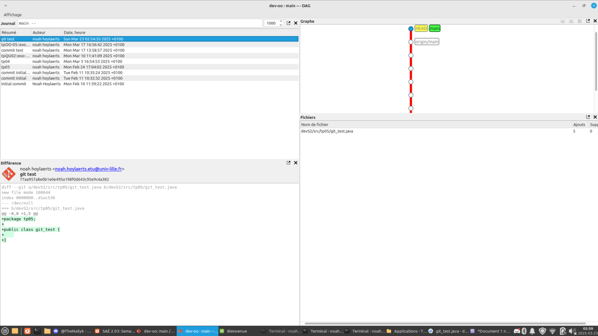

> Pour **lancer** gitk, il faut tout simplement lancer la commande gitk. \

* Qu’est-ce que le logiciel git-gui ? Comment se lance-t-il ? \

> [Git-gui](https://git-scm.com/docs/git-gui/fr) est une autre **interface graphique** pour git. \
> Il se concentre cependant sur la **génération** et le **perfectionnement** de commit, l'**annotation** de fichier et, contrairement à gitk, il ne permet pas de visualiser l'historique du dépôt. \

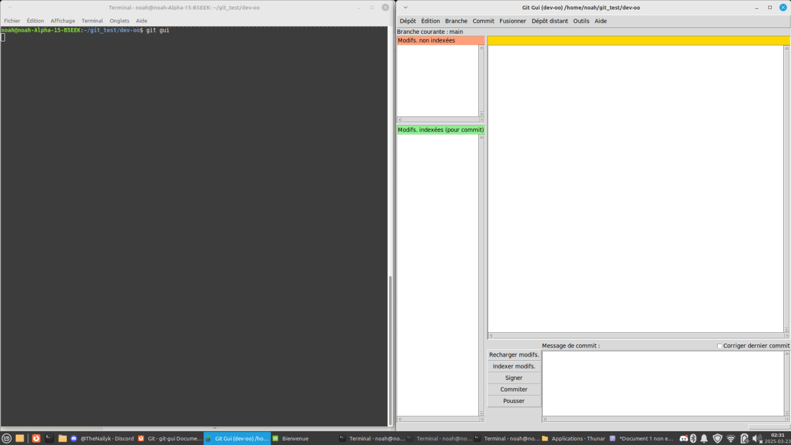

> Pour **lancer** git-gui, il faut lancer la commande git gui. \

---

## Une autre interface graphique pour git

L'interface graphique que nous avons décidé d'utiliser est git-cola. \

---------

### Questions

* Pourquoi avez-vous choisi ce logiciel ? \

> Nous avons choisi git-cola pour sa **simplicité de lancement** et son **interface minimaliste mais fonctionnelle**. \

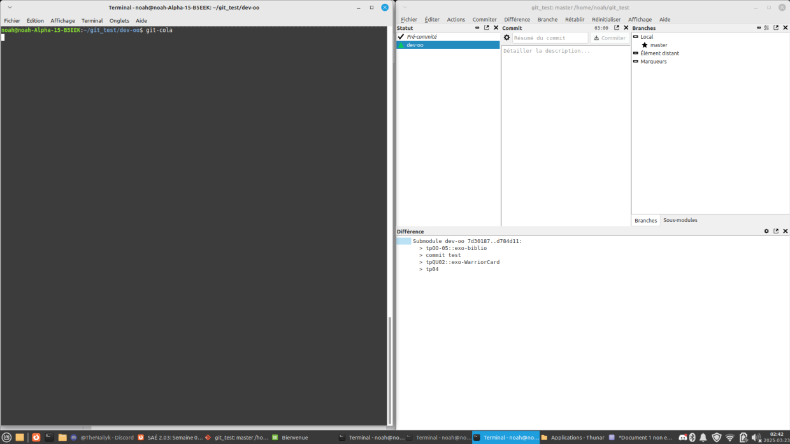

> Il se rapproche plus de **git gui** car il se concentre sur le **perfectionnement du commit**, et **non** sur la visualisation de l'historique. \
> Cet outil embarque aussi l'outil **git dag** permettant une **visualisation graphique**. \

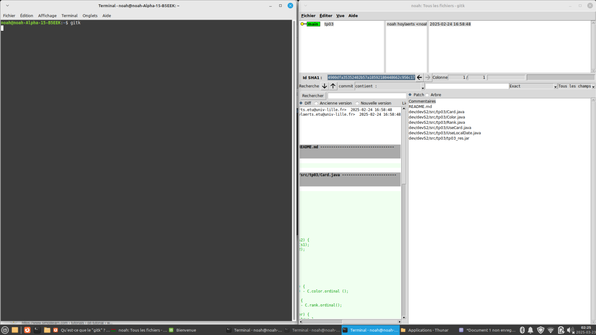

> Nous travaillons sur une seule machine, donc nous n'avons **pas besoin d'historique**. De plus, le tout étant en **local**, c'est un plus pour ceux ayant une mauvaise connexion.


* Comment l’avez vous installé ? \

> Nous l'avons installé avec cette commande : \
\
```
sudo apt install git-cola
```

* Comparez-le aux outils inclus avec git et ceux installés précédement, ainsi qu'avec les lignes de commandes pures : \

> Il faut **pré-commiter** lorsqu'on veut envoyer un fichier, tout comme avec "git add". \
> **Enregistrer un message** de commit est équivalent à "git commit -m "message". \
> Ensuite le commit va être envoyé et mis en attente d'un push, tout comme "git push". \
> Avoir une **interface graphique** facilite grandement la conpréhension de l'utilisation de git. \
> De plus, git-cola est compatible avec **Windows**, **MacOS** et de nombreuses distributions **Linux**. \
> Nous avons donc utilisé cet outils en tant qu'**outil principal** de gestion graphique git. \

---

# La forge logicielle Gitea

## Qu'est-ce que Gitea ?

---------

### Questions

* Qu’est-ce que Gitea ? \

> Gitea est une alternative à GitLab. \
> C'est une **forge** (système de gestion de texte) logiciel web permettant de gérer **plusieurs dépôts git** et gérer les **permissions** à ce dernier. \
> Il est 100% open source et est un **fork de Gogs**. La communauté a souhaité créer Gitea a cause de décisions étranges de la part des développeurs.

* À quels logiciels bien connus dans ce domaine peut-on le comparer ? \

> Gitea peut être comparé à **GitHub** et **GitLab**. \

* Qu’est-ce qu’un fork ? \

> Un **fork** (fourchette en français), est une branche auxiliaire d'un logiciel. \
> Un fork consiste en la **réutilisation** d'un code source (un fork se produit souvent avec des logiciel open source) pour produire quelque chose de similaire mais différents à la fois. \
> Le but est d'avoir une **direction de développement différente** pour par exemple **réparer les erreurs des anciens développeurs**. \

* De quel logiciel Gitea est-il le fork ? Ce logiciel existe-t-il encore ? \

> Gitea est le fork de **Gogs**. \
> Bien que Gitea soit désormais une **version améliorée**, Gogs existe toujours et il existe même plusieurs entreprises qui l'utilisent activement. \

---

## Installation de Gitea

Nous allons installer Gitea à l'aide du binaire. \
Nous allons donc suivre la [documentation officielle](https://docs.gitea.com/installation/install-from-binary). \
\
Pour commencer, on récupère le paquet et on le rend exécutable :

```
wget -O gitea https://dl.gitea.com/gitea/1.23.5/gitea-1.23.5-linux-amd64
chmod +x gitea

```
Puis nous devons vérifier la validité du binaire en utilisant une clé GPG :

```
gpg --keyserver keys.openpgp.org –recv 7C9E68152594688862D62AF62D9AE806EC1592E2

```
Nous vérifions que la version est supérieure à 2.0 grâce à cette commade :
```
git --version
```
Nous avons obtenu 2.39.5, c'est donc une version valide. \
Nous créons alors un utilisateur « git » qui sera notre exécuteur de Gitea : 
```
adduser \
--system \
--shell /bin/bash \
--comment 'Git Version Control' \
--gid git \
--home-dir /home/git \
--create-home \
git 
```
Si vous n'utilisez pas systemd, mettre un mot-de-passe est plus sûr :
```
sudo passwd git
```
Nous avons ensuite besoin de créer la structure du dossier Gitea :
```
sudo mkdir -p /var/lib/gitea/{custom,data,log}
sudo chown -R git:git /var/lib/gitea/
sudo chmod -R 750 /var/lib/gitea/
sudo mkdir /etc/gitea
sudo chown root:git /etc/gitea
sudo chmod 770 /etc/gitea
```
Puis nous le configurons :
```
export GITEA_WORK_DIR=/var/lib/gitea/
cp gitea /usr/local/bin/gitea
```
Enfin nous pouvons lancer Gitea et lancer sa véritable mise en place, en tant que git (effectuer la commande : su git, et entrer mot de passe) :
```
GITEA_WORK_DIR=/var/lib/gitea/ /usr/local/bin/gitea web -c /etc/gitea/app.ini
```
Dans votre terminal, vous optiendrez une ligne de ce style :
```
AppURL(ROOT_URL) : http://localhost:3000/
```
En allant sur ce lien, vous tomberez sur cette page de configuration de Gitea :

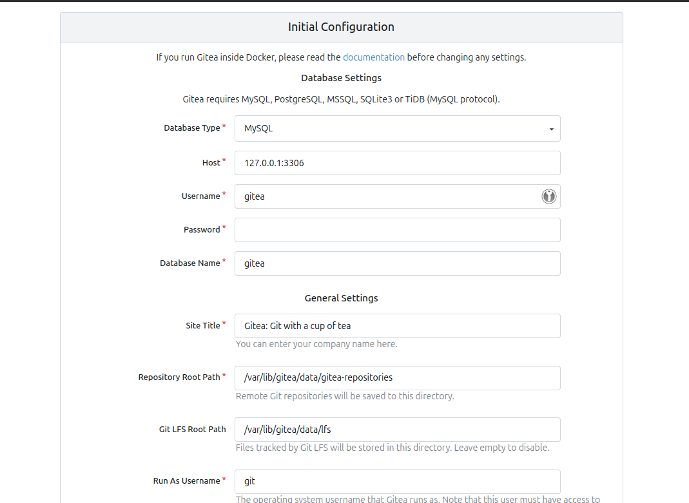

Nous devons alors modifier ces informations pour notre configuration : \
    - Database Type : SQLite 3  \
Dans la partie compte administrateur : \
    - Nom : gitea \
    - Courriel : git@localhost \
    - Mot de passe gitea \
Puis lancez l’installation. \

Une fois celle-ci terminée, vous obtiendrez votre depot Gitea, ou vous pourrez ajouter des depots et organisations :

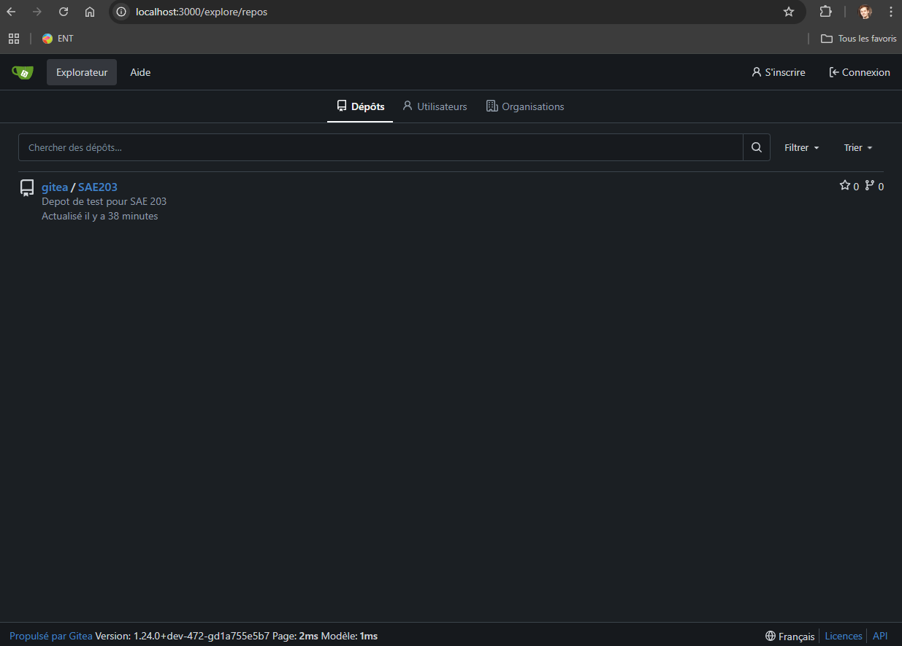

Vous pouvez ainsi ajouter des utilisateurs qui auront différents droits et accès trouvable dans administration du site en haut à droite :

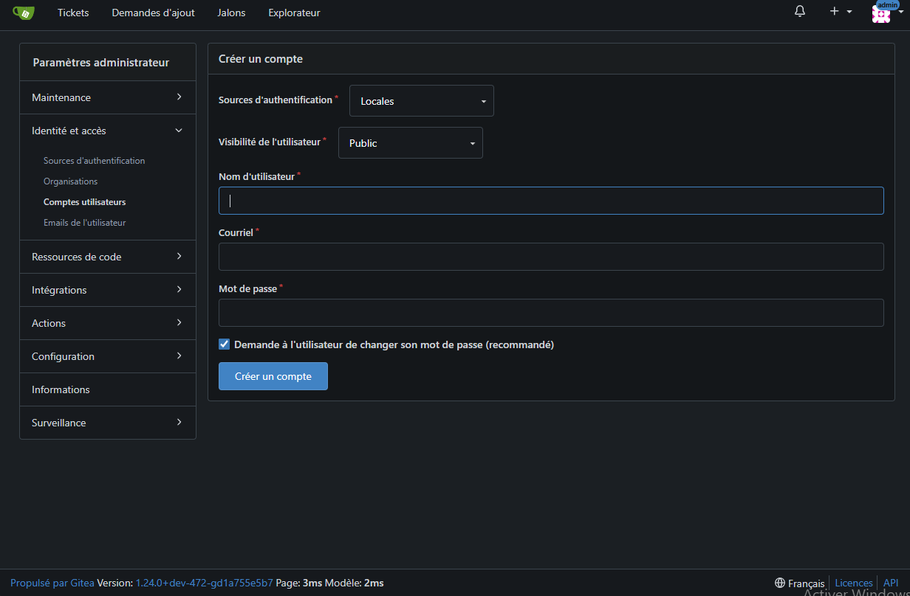

Vous pouvez tout configurer, mettre un autre utilisateur administrateur, les restreindre, etc... \
Maintenant vous pouvez effectuer les mêmes actions qu’avec Git, n’oubliez pas de bien configurer vos répertoires de travail: \
 Exemple : `git remote add origin http://localhost:3000/gitea/SAE203.git` \
Pour accéder à notre dépôt distant hors de notre machine virtuelle, nous devons ajouter une redirection de port. \
Dans la configuration de notre VM sur VirtualBox, allons dans Réseau :

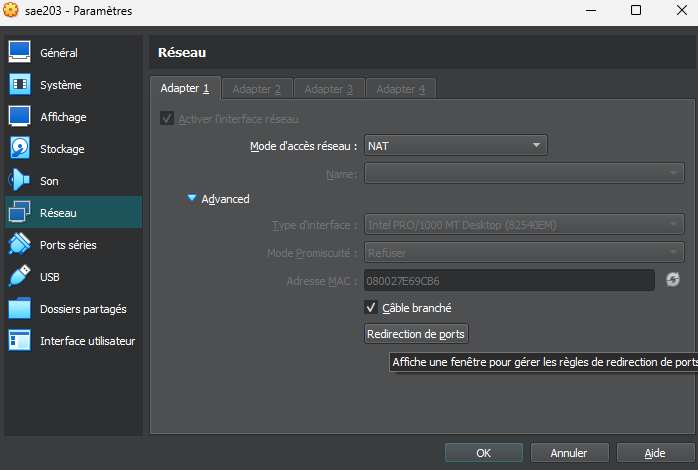

Puis dans Redirection de ports, nous pouvons ajouter une redirection (icône avec +) et y mettre les informations :

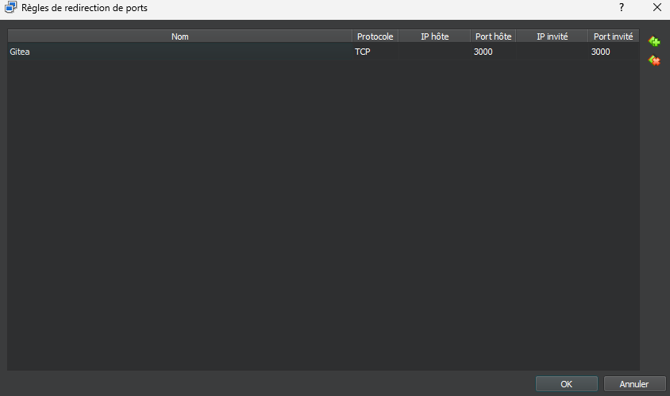

Vous pouvez maintenant accéder à votre depot depuis une autre machine du réseau. \
Cela ressemble donc à cela :

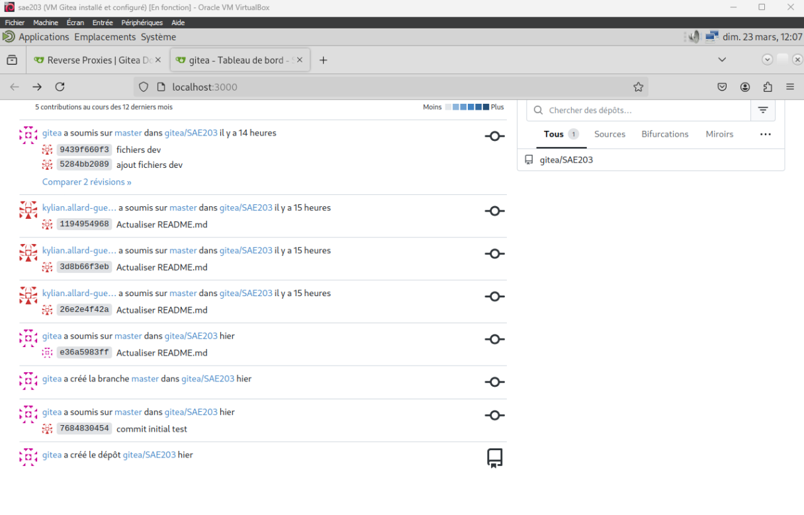

## Mise à jour de Gitea

Avant d’effectuer la mise à jour, il est recommandé de faire une backup pour eviter une perte des donnees. En cas de problemes ce rendre sur [cette page](https://docs.gitea.com/next/administration/backup-and-restore). \
Pour mettre à jour votre dépôt Gitea, arrêtez votre service Gitea. \
Il vous faut le fichier binaire contenant les informations de la version voulue, dans notre cas celui de la version 1.24-dev, puis simplement remplacer le fichier binaire déjà présent dans :
```
/usr/local/bin/gitea
```

[^NAT]: NAT : https://www.it-connect.fr/comprendre-les-differents-types-de-reseaux-virtualbox/#A_Le_mode_NAT
[^invit]: Systèmes invités : https://doc.ubuntu-fr.org/virtualbox_additions_invite 
